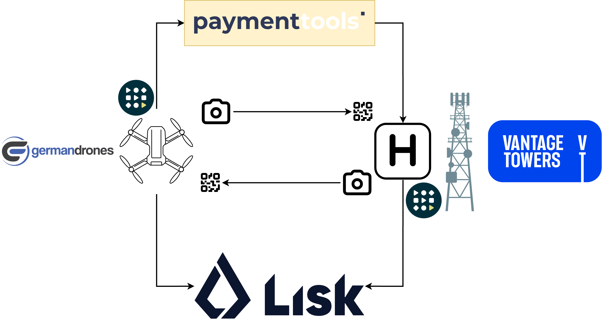

# RISE-next

RISE (dRone InfraStructure paymEnts).

The goal of the project is to assess feasibility of creating a new revenue stream for cell tower companies (TowCo) by sharing revenue from operating drone ports placed near cell towers. Each time a drone lands or takes off, the drone port debits the drone operator’s wallet and credits the cell tower company’s (land provider) wallet. The amount of money a drone operator pays to the drone port operator and the percentage of money that goes to the cell tower company is configurable and is agreed by a contract between the corresponding companies which is stored in on-chain using smart contract.

Each ground station and drone will have a wallet, and the application will run on the router directly attached to the ground station and on the drone’s on-board computer. The router — or cloud-in-a-box, as we call it — features a web UI and marketplace for installing applications that run on the router inside containers. The RISE application will also be packaged for cloud-in-a-box which makes it very well integrated into Staex platform: it will receive automatic software updates and will be installed and configured via standard means. Nevertheless, full functionality of the application including web UI will be available to users that do not have Staex’s cloud-in-a-box without any restrictions.

https://staex.io/web3-drone-corridor



[Docs](./docs/)

## Usage

Setup .env file in project root folder to make Makefile target easier to user.

### Local

```shell
RPC_URL=http://127.0.0.1:8545
PRIVATE_KEY=0xac0974bec39a17e36ba4a6b4d238ff944bacb478cbed5efcae784d7bf4f2ff80
LANDING_WAIT_TIME=10
```

### Sepolia

```shell
RPC_URL=https://ethereum-sepolia.publicnode.com
PRIVATE_KEY=
LANDING_WAIT_TIME=300
```

### Lisk Sepolia

```shell
RPC_URL=https://rpc.sepolia-api.lisk.com
PRIVATE_KEY=
LANDING_WAIT_TIME=300
```

To send some tokens from Sepolia to Lisk Sepolia use following bridge: https://sepolia-bridge.lisk.com/bridge/lisk-sepolia-testnet.

### After config preparations

After that execute commands in order:

```shell
make anvil
make deploy
cd agent && make run
```

## Generate binding for Rust

```shell
make build
```

Sometime it is better to delete `contracts/out` and `agent/src/contracts` to remove old files to generate only actual contracts.
It happens when you rename some contract or you stopped to use some smart contract.

## Create new wallets

```shell
cast wallet new
```

### Send some tokens to created wallet

```shell
source .env
cast send --value 0.1ether --private-key ${PRIVATE_KEY} %address% --rpc-url ${RPC_URL}
cast balance %address% --rpc-url ${RPC_URL}
cast to-unit 19903268211300622 ether
```

## Faucet

As now we use Sepolia testnet you can use this faucet for test tokens: https://sepolia-faucet.pk910.de/

## Dev setup

`.vscode/settings.json`:

```json
{
  "solidity.packageDefaultDependenciesContractsDirectory": "contracts/src",
  "solidity.packageDefaultDependenciesDirectory": "contracts/lib",
  "solidity.formatter": "forge",
  "solidity.compileUsingRemoteVersion": "v0.8.22",
}
```

### Remote Linux setup without camera access

#### Fedora

```shell
# Install video loopback and enable it.
sudo dnf install https://download1.rpmfusion.org/free/fedora/rpmfusion-free-release-$(rpm -E %fedora).noarch.rpm
sudo dnf install v4l2loopback
sudo modprobe v4l2loopback

# Write some video to device.
sudo ffmpeg -i video.mov -f v4l2 /dev/video0
```
